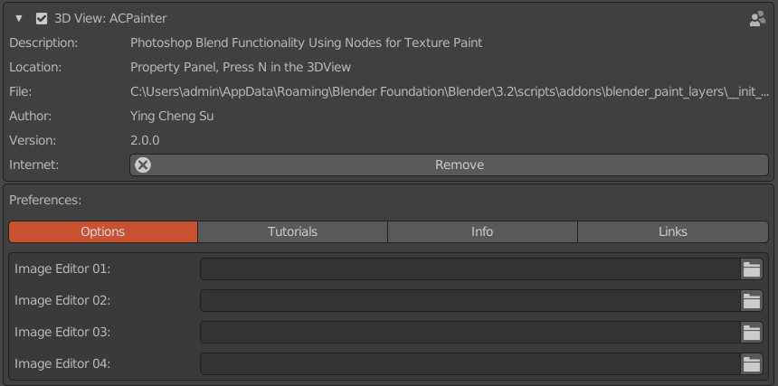
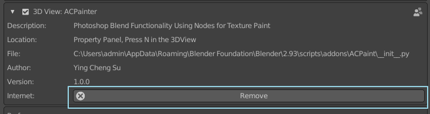
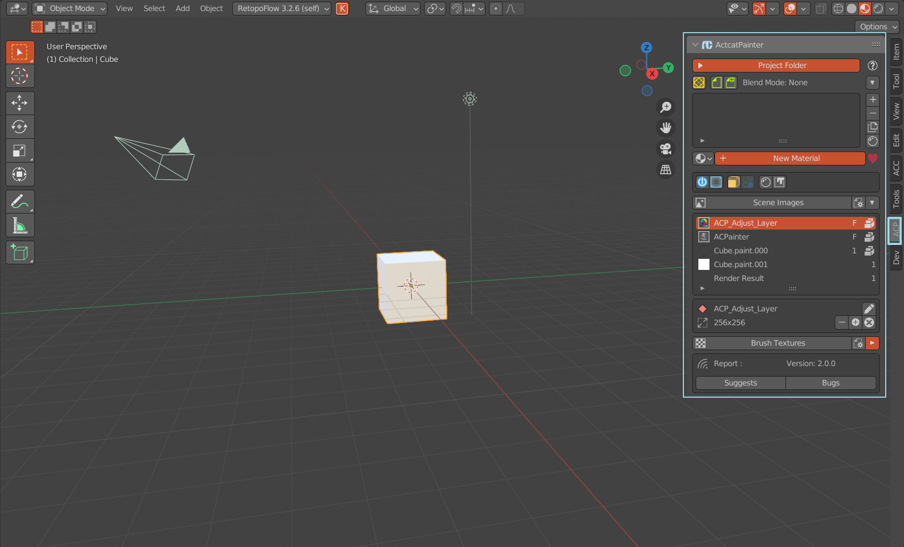

****
開始
****

安裝
====

    當您購買ACPainter 後，您將可以訪問包含整個插件包的.zip 文件。在Blender中菜單欄 :menuselection:`Edit --> Preference --> Addon` 
    面板中選擇install按鈕安裝zip檔案，如果順利安裝，就可以看到ACPainter的相關資訊。 

    ACPainter Addon

更新
====

    1. 從Blender完全卸載舊版本ACPainter。
    2. 關閉並重新啟動 Blender 以確保清除所有緩存文件。
    3. 正常安裝新版本。

    卸載ACPainter    

在 Blender 中尋找 ACPainter
============================

    ACPainter位於3D VIewer右側面板上的分頁標籤中。

    ACPainter視窗位置

準備繪畫
========
    ACPainter已經將繁瑣的節點設定過程自動化，主要的設定過程如下：
        
    1. 選擇要繪畫的3DMesh物件。
    2. 給予選擇的物件材質。
    3. 確認材質節點為 Material Output，輸入通道為Surface，新增一組LayerChannel。
    4. 新增PaintLayer。
    5. 切換至TexturePaint模式，即可開始繪畫。 

重要注意事項（請閱讀）
=======================
    為了有舒適的ACPainter使用體驗，請小心以下的使用行為：

    1. 請避免同時使用相關的紋理Painter工具，因為相關的工具可能使用了大致相同但有差異的程式行為，可能會彼此干擾，使ACPainter無法獲得預期的行為效果。如果一定要混合使用，請隨時注意相關異常行為。
    2. 由ACPainter所創建的材質節點，請不要非經由ACPainter面板做相關改動(除非您已了解相關運作原理與風險)，否則極可能造成ACPainter運作失常。
    3. 除了以上的注意點，ACPainter應該是十分友善且運作穩定的工具，祝您有美好的使用體驗。