**************
主介面詳細解說
**************

專案資料夾面板
=====================
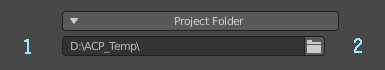
   
   專案資料夾面板

* 1.專案資料夾路徑。
* 2.專案資料夾選擇鈕。絕對路徑與相對路徑可在其中修改，按住Alt點擊可用檔案總管開啟選定的資料夾。*

      .. note:: 
         如果路徑不是絕對路徑而引起相關操作錯誤，將路徑改為絕對路徑即可。

資料夾瀏覽器 
---------------------------------------------------------------------------------------
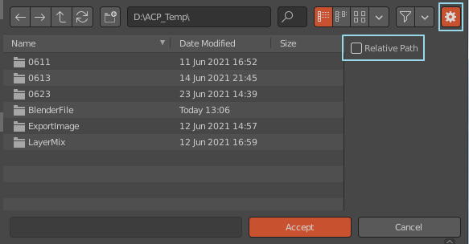

   打開資料夾瀏覽器時修改相對路徑為絕對路徑

物件材質列表
=====================
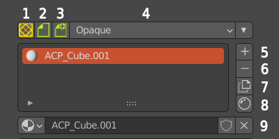

   物件材質列表

* 1.轉換為AssetMode環境。
* 2.ACPainter存檔功能：存檔時會將未存檔的影像一起儲存。如果檔案已經存檔，則按原名覆蓋存檔，如果沒有存檔過，則存檔為"ACP(Save)-日期"名稱。
* 3.ACPainter另存新檔功能：另存新檔時會將未存檔的影像一起儲存。儲存一個檔案，名稱為"ACP(Save)-日期"名稱。
* 4.材質3D視窗中的顯示方式：有Opaque、Alph Clip、Alpha Hashed、Alpha Blend四種顯示方式。
* 5.增加材質。
* 6.刪除材質。
* 7.複製材質。
* 8.打開材質編輯器。
* 9.場景材質列表欄。

   .. note:: 
      存檔功能需要設定好專案資料夾才能正常運作。

圖層通道面板
=====================
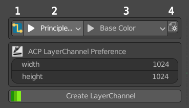

   圖層通道面板-直線模式

* 1.直線模式(可切換為自由模式)。直接將圖層通道連接於指定的材質節點位置上。
* 2.選擇材質中ACPainter有支援的材質節點。
* 3.選擇材質節點中ACPainter有支援的輸入通道。
* 4.圖層通道-直線模式過濾選項。

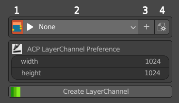

   圖層通道面板-自由模式

* 1.自由模式(可切換為直線模式)。於材質中產生圖層通道節點，須自行連接使用。
* 2.圖層通道列表。
* 3.增加圖層通道。
* 4.圖層通道-自由模式功能選項。

創建圖層通道面板 
---------------------------------------------------------------------------------------
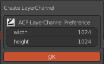

   創建圖層通道面板

* Width：創建圖層通道影像寬度值。
* Height：創建圖層通道影像高度值。

圖層列表
=====================
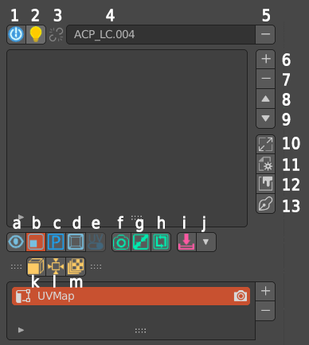

   圖層列表

* 1.設定3DViewport為ACPainter繪圖環境。
* 2.設定材質顯示為此圖層通道顏色效果。
* 3.顯示此圖層通道是否有導入的節點來源(可以開關)。
* 4.圖層通道名稱。
* 5.刪除圖層通道。
* 6.增加圖層。
* 7.刪除圖層。
* 8.圖層往上。
* 9.圖層往下。
* 10.圖層通道色彩環境設定與影像縮放面板。
* 11.圖層工具設定面板。。
* 12.打開影像編輯器。
* 13.使用精要模式(盡量關閉不需要的面板顯示)。

* a.單一圖層繪畫模式。
* b.顯示圖層影像開關。
* c.PS_Mode混色模式。
* d.物件視窗顯示模式切換。
* e.切換3D模型與UV的平面佈局。
* f.攝影機投影--抓圖至外部2D編輯軟體開啟。
* g.攝影機投影--投影從外部2D編輯軟體導入。
* h.攝影機自投影--抓圖後直接投射至模型上。
* i.合併可見圖層(按Ctrl鍵使用自定義算圖參數合併)。
* j.下方收納選項開關。
* k.UV-Mesh展開(會複製原模型)。將所選的3D模型展開為UV的平面佈局。
* l.攝影機六方向全景投影。
* m.輸出可視圖層至專案資料夾中。

   .. note:: 
      輸出圖檔功能需要設定好專案資料夾才能正常運作。

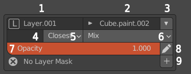

   圖層資訊面板

* 1.圖層名稱(可自由更名)。
* 2.圖層對應的影像名稱(可更名)。
* 3.圖層參數收納選項開關
* 4.圖層對應的UV名稱(空白則使用預設值)。
* 5.縮放圖層影像演算方法。
* 6.圖層混合模式。
* 7.圖層不透明度。
* 8.將圖層輸出至外部2D軟體編輯。
* 9.增加圖層遮罩。

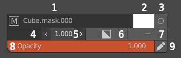

   圖層遮罩資訊面板    

* 1.圖層遮罩對應的影像名稱(可更名)。
* 2.圖層遮罩對應的底色(為白色或黑色，影響透明度功能)。
* 3.編輯繪畫圖層遮罩。
* 4.圖層遮罩對應的UV名稱(空白則使用預設值)。
* 5.圖層遮罩邊緣銳利度。
* 6.反相圖層遮罩。
* 7.刪除圖層遮罩。
* 8.圖層遮罩不透明度。。
* 9.將圖層遮罩輸出至外部2D軟體編輯。

新增圖層面板 
---------------------------------------------------------------------------------------
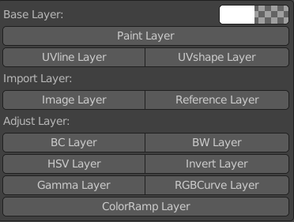

   新增圖層面板

* Paint Layer：繪畫圖層，可以設定顏色與不透明度。
* UVline Layer：模型UVlayout的線框圖層。
* UVshape Layer：模型UVlayout的線框與形狀圖層。
* Image Layer：影像圖層，從外部影像導入Blender，導入後不再與原文件連結，可再繼續繪圖修改。
* Reference Layer：參考圖層，從外部影像導入Blender，導入後繼續與原文件連結，不可繪圖修改，但可隨原文件更新。
* BC Layer：調整圖層，調整圖層影像明度、對比度。
* BW Layer：調整圖層，將圖層影像轉為灰階影像。
* HSV Layer：調整圖層，調整圖層影像色相、飽和度、明度。
* Invert Layer：調整圖層，將圖層影像反相。
* Gamma Layer：調整圖層，調整圖層影像Gamma值。
* RGBCurve Layer：調整圖層，調整圖層影像RGB值曲線。
* ColorRamp Layer：調整圖層，調整圖層影像漸層對應效果。

   更詳細使用方法請參閱圖層章節

圖層通道影像縮放面板
---------------------------------------------------------------------------------------
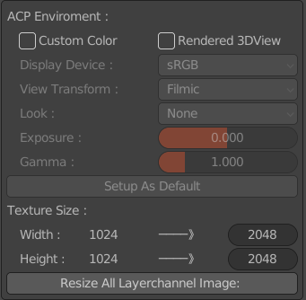

   圖層通道色彩環境設定與影像縮放面板

* Custom Color：使用自訂義的色彩環境參數(啟動PS_Mode則會強制設為該模式的色彩環境參數)。
* Rendered 3DView：設定3DViewport為ACPainter繪圖環境時為Rendered類型。
* Setup As Default：將上方色彩環境參數設為預設值。
* Width：現在圖層通道影像寬度值\\欲修改後圖層通道影像寬度值。
* Height：現在圖層通道影像高度值\\欲修改後圖層通道影像高度值。
* Resize All Layerchannel Image：縮放所有圖層通道內影像

圖層工具設定面板
---------------------------------------------------------------------------------------
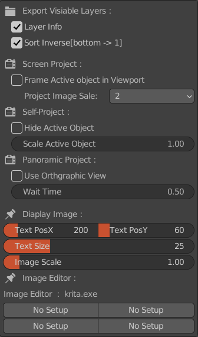

   圖層工具設定面板

* Layer Info：輸出影像圖層是否攜帶影像資訊，圖層順序編號、混合方式、不透明度。
* Sort Inverse：輸出影像圖層排序方法，啟用時，最下方圖層為第一層圖層，反之，最上方圖層為第一層圖層。
* Frame Active Object in Viewport: 攝影機投影捉圖時是否在視窗中最大化模型。
* Project Image Scale：攝影機投影時抓圖大小比例，值越大越清晰，但是速度越慢。
* Hide Active Object：自投影與全景投影時，隱藏所選物件。
* Scale Active Object：自投影與全景投影時，縮放選擇的物件。
* Use Orthgraphic View：全景投影時，使用無透視正交視角。
* Wait Time：全景投影時，每次投影時間隔時間。

   更詳細使用方法請參閱圖層與攝影機投影章節
 
* Text PosX：3D視窗上文字資訊的水平位置。
* Text PosY：3D視窗上文字資訊的垂直位置。
* Text Size：3D視窗上文字大小。
* Image Scale：3D視窗上顯示的圖像比例大小。
* Image Editor：可切換由ACPainter Addon Perference中設定的4種外部2D編輯軟體。

畫筆列表面板
=====================
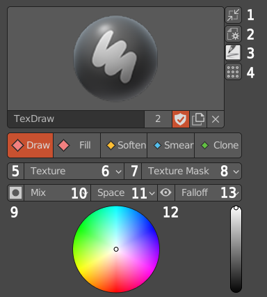

   畫筆列表面板

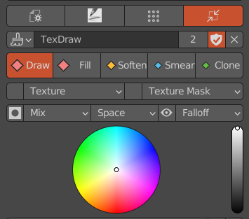

   縮小版畫筆列表面板

* 1. 筆刷面板縮小鈕。
* 2. 筆刷面板設定選項鈕。
* 3. 載入ACPainter筆刷。
* 4. 開啟下方色票票版。
* 5. 筆刷Texture顯示鈕。筆刷有使用Texture會高亮顯示。
* 6. 筆刷Texture設定選項鈕。
* 7. 筆刷Texture Mask顯示鈕。筆刷有使用Texture Mask會高亮顯示。
* 8. 筆刷Texture Mask設定選項鈕。
* 9. 筆刷鎖定圖層Alpha繪畫。
* 10. 筆刷混合模式。
* 11. 筆刷Stroke類型。
* 12. 顯示筆刷尺寸範圍。
* 13. 筆刷強度衰減類型。
 
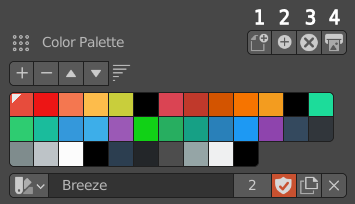

   色票面板

* 1. 載入一組全新的色票(Gimp色票檔案.gpl)。
* 2. 添加一組全新的色票(Gimp色票檔案.gpl)至目前色票中。
* 3. 刪除現在所選的色票。
* 4. 輸出Gimp色票檔案(.gpl)。
 

場景影像瀏覽器
=====================
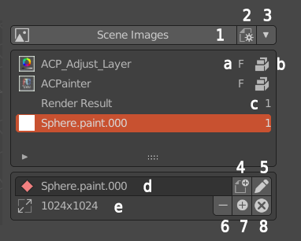

   場景影像瀏覽器

* 1.將顯示的圖像同步場景影像瀏覽器。
* 2.設定場景影像瀏覽器顯示影像數量。
* 3.場景影像瀏覽器收納開關。
* 4.將所選影像轉換成繪畫圖層或圖層遮罩。
* 5.將所選影像輸出至外部2D軟體編輯。
* 6.刪除影像。如果影像在任何圖層中使用則不會刪除。
* 7.從外部導入影像。
* 8.刪除所有沒有使用者的場景影像。
* a.Fake User。
* b.影像打包至檔案中。
* c.使用者數量。
* b.影像名稱(可更名)。
* b.影像尺寸。

筆刷紋理瀏覽器
=====================
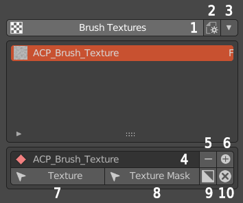

   紋理瀏覽器

* 1.將屬性面板轉到紋理分頁。
* 2.設定紋理瀏覽器顯示紋理數量。
* 3.紋理瀏覽器收納開關。
* 4.紋理名稱(可更名)。
* 5.刪除紋理。
* 6.從外部新增紋理。
* 7.將紋理瀏覽器中顯示的紋理指定給當前筆刷的紋理。
* 7.將紋理瀏覽器中顯示的紋理指定給當前筆刷的紋理遮罩。
* 8.反相紋理。
* 9.刪除所有沒有使用者的紋理。

