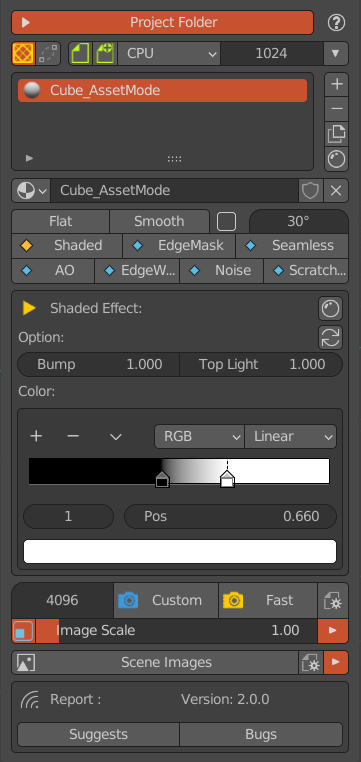

*****************
AssetMode介面總覽
*****************

AsserMode面板
==============
AsserMode面板包含多個與主面板相同的部分，像是專案資料夾面板、物件材質列表面板、場景影像瀏覽器等等。除此之外，AsserMode面板會根據所選的Shader
類型切換不同的介面。目前支援7種紋理效果。

   AssetMode面板
