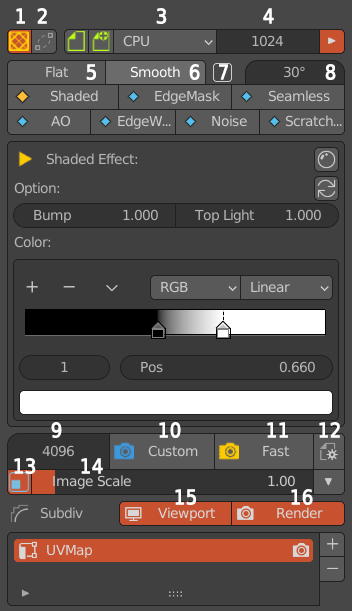
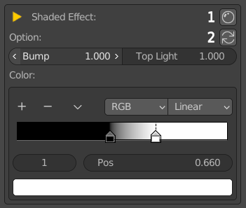
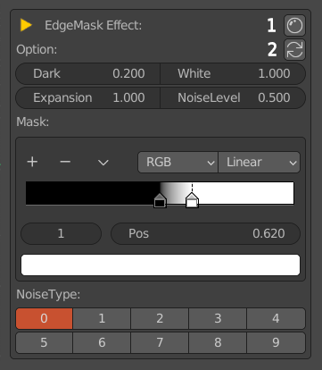
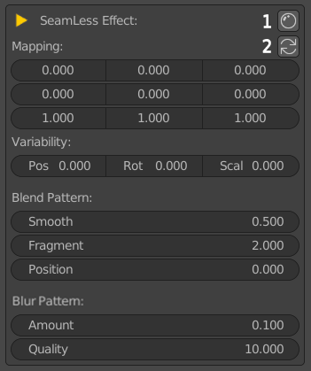
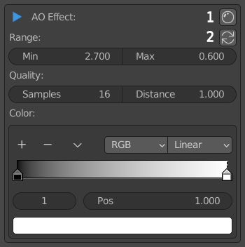
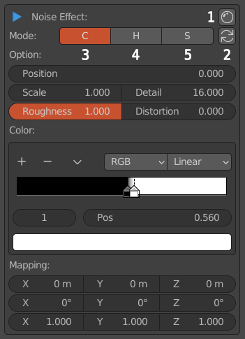
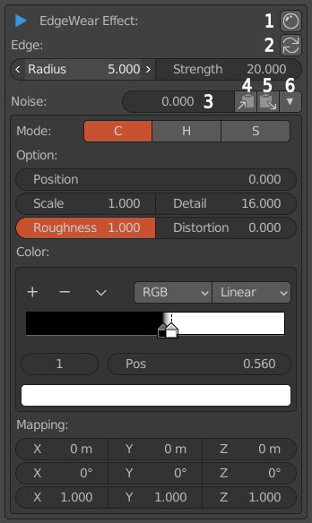
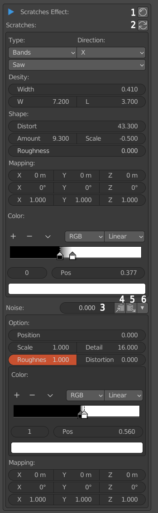

*********************
AssetMode介面詳細解說
*********************

AssetMode主介面面板
=====================

   
   AssetMode主介面面板

* 1.退出AssetMode模式返回圖層通道狀態。
* 2.重建烘焙物件與原物件連結。
* 3.視窗預覽時使用的設備。
* 4.視窗預覽採樣數。
* 5.模型使用Flat著色。
* 6.模型使用Smooth著色。
* 7.啟用自動平滑功能。
* 8.自動平滑角度。
* 9.算圖採樣數。
* 10.使用自訂義的算圖採樣數(9)算圖。
* 11.使用最快速算圖採樣數算圖(算圖結果不精緻，除了Shaded Effect)。
* 12.AssetMode選項面板。
* 13.3D視窗上顯示的圖像開關。
* 14.3D視窗上顯示的圖像比例大小。
* 15.視窗預覽時Subdiv修改器效果開關。
* 16.算圖時Subdiv修改器效果開關。

Shaded Effect
=====================

   
   Shaded Effect面板

* 1.打開材質編輯器。
* 2.回復至預設值。
* Bump：加強模型凹凸處光影效果。
* Top Light：加強模型垂直方向光影效果。
* Color：設定光影漸層變化的顏色。

EdgeMask_Effect
=====================

   
   EdgeMask_Effect面板

* 1.打開材質編輯器。
* 2.回復至預設值。
* Dark：紋理黑色強度。
* White：紋理白色強度。
* Expansion：控制黑白色交界處邊緣效果。
* NoiseLevel：白色雜訊強度。
* Mask：控制黑白顏色的臨界值。
* NoiseType：10種不同效果的EdgeMask Effect。

Seamless Effect
=====================

   
   Seamless Effect面板

* 1.打開材質編輯器。
* 2.回復至預設值。
* Mapping：投影貼圖座標值，左到右分別為X、Y、Z，上到下分別為位置、旋轉、縮放。
* Variability：投影貼圖座標變化值。
* Pos：位置的正負變化值。
* Rot：旋轉的正負變化值。
* Scal：縮放的正負變化值。
* Blend Pattern：碎形混合紋理參數(更改Variability數值為非零後才有效果)。
* Smooth：碎形紋理平滑度。
* Fragment：碎形紋理破碎度。
* Position：碎形紋理位置。
* Blur Pattern：模糊化碎形紋理(更改Variability數值為非零後才有效果)。
* Amount：模糊化碎形紋理強度值。
* Quality：模糊化碎形紋理採樣值(值越大越精細)。

AO Effect
=====================

   
   AO Effect面板

* 1.打開材質編輯器。
* 2.回復至預設值。
* Range：AO效果的灰階範圍。
* Min：AO效果最小閥值。
* Max：AO效果最大閥值。
* Quality：AO效果的品質。
* Samples：AO效果採樣數。
* Distance：其他對象被視為遮擋著色點的距離。
* Color：AO效果對應的顏色漸層。

Noise Effect
=====================

   
   Noise Effect面板

* 1.打開材質編輯器。
* 2.回復至預設值。
* 3.Noise紋理灰階值顏色效果。
* 4.Noise紋理色相值效果。
* 5.Noise紋理飽和度值效果。。
* Option：Noise參數選項。
* Position：Noise紋理的位移值。
* Scale：Noise紋理的縮放值。
* Detail：Noise紋理的細節值。
* Roughness：Noise紋理的粗糙值。
* Distortion：Noise紋理的扭曲值。
* Color：Noise紋理對應的顏色漸層。
* Mapping：Noise紋理對應的平移、旋轉和縮放映射值，第一排為平移值，第二排為旋轉值，第三排為縮放值。

EdgeWear Effect
=====================

   
   EdgeWear Effect面板

* 1.打開材質編輯器。
* 2.回復至預設值。
* 3.Noise紋理遮罩強度值。
* 4.將Noise紋理參數拷貝至Noise Effect面板。
* 5.將Noise Effect面板紋理參數拷貝至本面板。
* 6.Noise紋理參數面板收納開關。
* Edge：Edge Wear效果邊緣參數。
* Radius：邊緣寬度。
* Strength：邊緣強度值。
* Noise：Noise紋理參數選項，解說參照Noise Effect面板。

Scratches Effect
=====================

   
   Scratches Effect面板

* 1.打開材質編輯器。
* 2.回復至預設值。
* 3.Noise紋理遮罩強度值。
* 4.將Noise紋理參數拷貝至Noise Effect面板。
* 5.將Noise Effect面板紋理參數拷貝至本面板。
* 6.Noise紋理參數面板收納開關。
* Type：刮痕類型與刮痕重複方式。
* Direction：邊緣方向。
* Desity：刮痕密度選項。
* Width：刮痕寬度值。
* W：Widthwise，刮痕橫向密度。
* L：Lengthwise，刮痕縱向密度。
* Shape：刮痕造型選項。
* Distort：刮痕扭曲值。
* Amount：扭曲躁波值強度。
* Scale：扭曲躁波縮放。
* Roughness：扭曲躁波粗糙值。
* Mapping：刮痕紋理對應的平移、旋轉和縮放映射值，第一排為平移值，第二排為旋轉值，第三排為縮放值。
* Color：刮痕紋理對應的顏色漸層。
* Noise：Noise紋理參數選項，解說參照Noise Effect面板。

