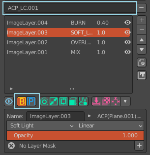
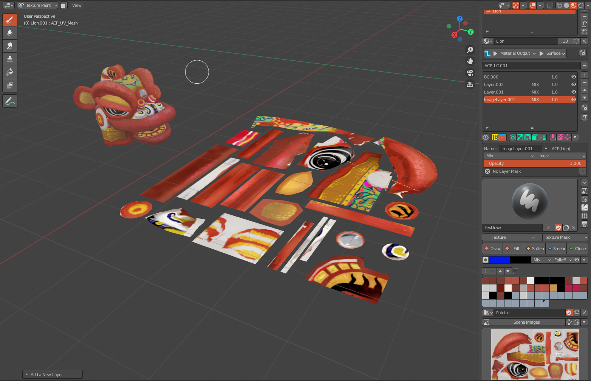

*********
混色模式
*********

混色模式的比較
==============

如果您常使用Blender來做3D模型紋理繪製，您會發現Blender的影像混合效果並不像Photoshop或是Krita中色彩呈現的效果，這樣的不一致成為了在Blender中紋理繪製
的最大痛苦，因為同樣的色彩影像，在不同的軟體中成色卻有很大的不同，在Photoshop與Krita，同樣的圖層與混色效果比Blender中預設的效果更為色彩繽紛、也更為
有細節層次。

ACPainter試圖去減低這樣的不一致，唯有降低了Blender與2D繪圖軟體的混色差異，才讓ACPainter的圖層系統能有與其他2D繪圖軟體溝通
的可能性。

以下為ACPainter使用不同色彩模式模擬同樣圖層混合效果的PSD檔案。

.. figure:: images/BlendMode_ACPainter.png
   :alt: BlendMode_ACPainter.png
   :align: center
   :width: 700px 

   ACPainter圖層混色模式比較

.. figure:: images/BlendMode_PSD_file.png
   :alt: BlendMode_PSD_file.png
   :align: center
   :width: 500px 

   PSD檔案內的圖層混色說明

兩種色彩空間混色模式
=====================
ACPainter提供了新的混色模式，稱之為PS_Mode，主要就是模擬PSD檔案的混色效果方便繪圖，沒有啟用PS_Mode時則套用預設色彩模式(使用者可自訂義
要使用的色彩管理狀態)，可以隨時切換PS_Mode狀態，並且不同的圖層通道亦可套用不同的PS_Mode狀態，方便於擴展使用的範圍。

   圖層通道混色效果切換

取色方法
========
* 不啟動PS_Mode(預設值)
   可在影像編輯器(ImageEditor)與3D視窗(3DViewport)中用取色器取得期望中的顏色。

* PS_Mode
   ACPainter提供的PS_Mode混色模式，會將圖像轉換至不同色彩空間，所以在影像編輯器(ImageEditor)中取色器將無法取得期望中的顏色，只有從3D視窗(3DViewport)
   才能取得期望中的顏色。

   為此，ACPainter提供了一個將3D視窗(3DViewport)變為類似影像編輯器(ImageEditor)的方法。
      1. 使用ACPainter提供的UV_Mesh功能，將3D模型轉變為UV的佈局。
      2. 可搭配UV_Mesh切換功能，隨時將UV的佈局再變回3D模型。
      3. 在3D視窗(3DViewport)中自由繪畫、取色吧！

.. figure:: images/BlendMode_UV_Mesh.png
   :alt: BlendMode_UV_Mesh.png
   :width: 300px
   :align: center

   UV_Mesh功能按鈕

   
   搭配UV_Mesh展開功能，於視窗直接模擬紋理繪畫

