*****
圖層
*****

圖層種類
==========
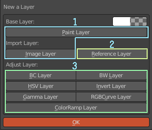

   圖層種類   
   
1. 繪畫圖層。包含兩種類型，一種是純色繪畫圖層，一種是經由影像(外部導入或是Blender中的影像)建立的繪畫圖層，共通點是可以在其上繼續進行加工繪製。
2. 參考圖層。由外部導入影像後不可再繼續加工的圖層，主要設計來導入PSD多圖層檔案，也可以利用此圖層將ACPainter繪畫圖層合併其中。
3. 調整圖層。可以在不影響其它繪畫圖層與參考圖層的狀態下進行色彩的調整。

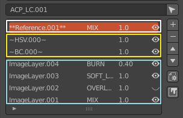

   圖層表現方式

不同的圖層類型，在圖層編輯器中的表現方式都不同，可以輕鬆辨識，每種圖層都可再添加圖層遮罩，做更進一步的調整。
影像圖層指的是繪畫圖層與參考圖層。  

影像圖層輸出
=============
ACPainter可以輸出繪畫圖層與參考圖層的影像，過程相當簡單。

1.  設定好專案資料夾路徑。
2.  選擇要輸出的影像圖層，將其他不要輸出的圖層取消顯示。
3.  設定圖層輸出資訊(含圖層順序、混合模式、不透明度)、排序方向。
4.  點擊輸出圖層功能鈕。
5.  打開檔案總管確認。 

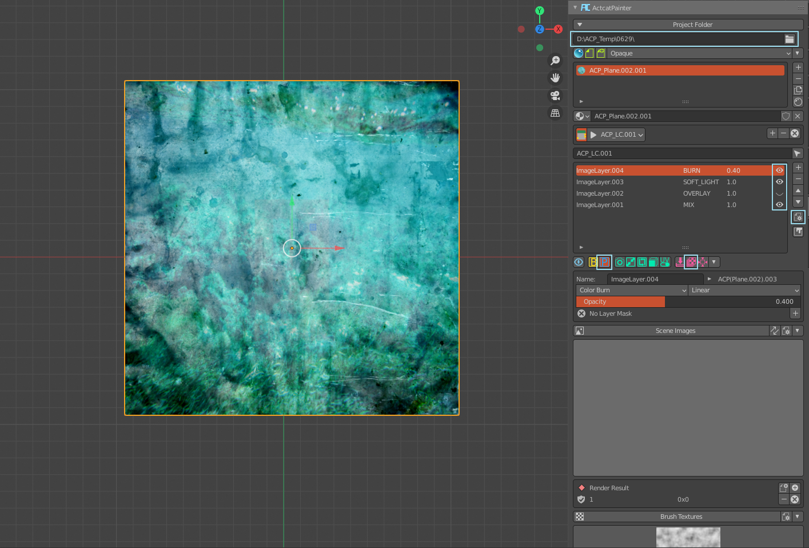

   輸出圖層前檢查

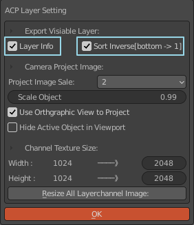

   輸出圖層前設定

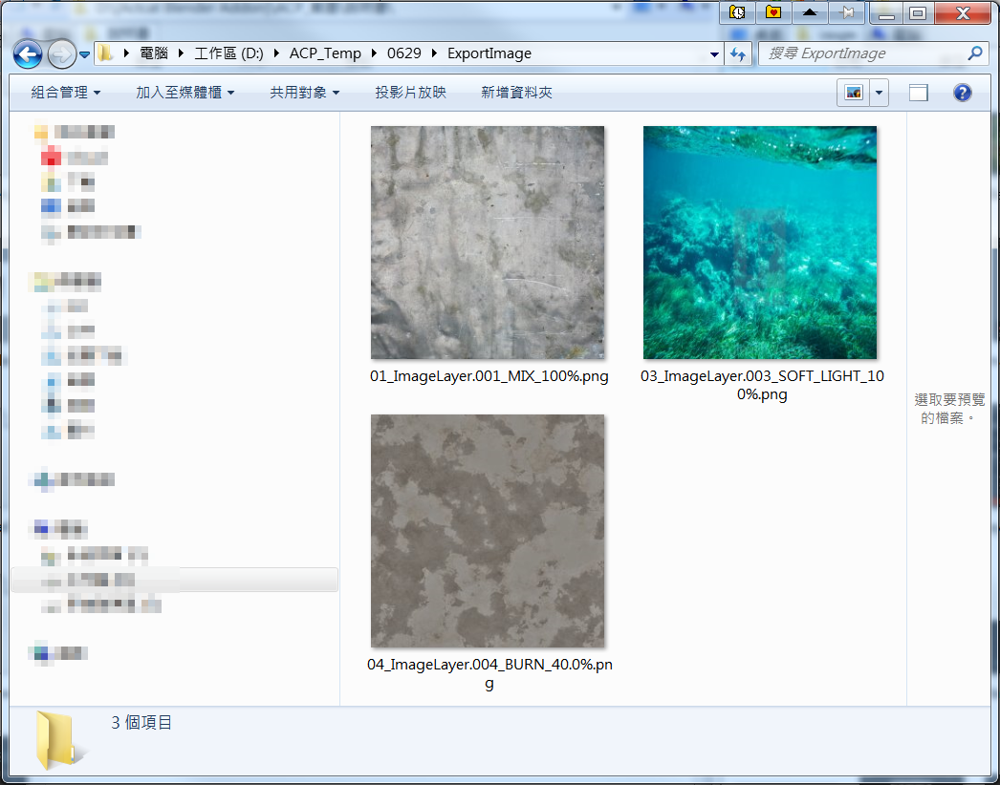

   輸出圖層至專案資料夾中

合成PSD檔案--Krita
====================
1. 啟用圖層資訊、設定圖層正確排序，輸出圖層。
2. 開啟Krita，建立一個符合輸出圖層影像大小的檔案。
3. 一次導入輸出的圖層影像，會按照順序排列好。
4. 按照導入的圖層影像資訊，設定圖層混合模式、不透明度。
5. 儲存成PSD檔案，便可再導入ACPainter中做為參考圖層，方便隨時修正。

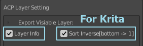

   輸出圖層給Krita設定

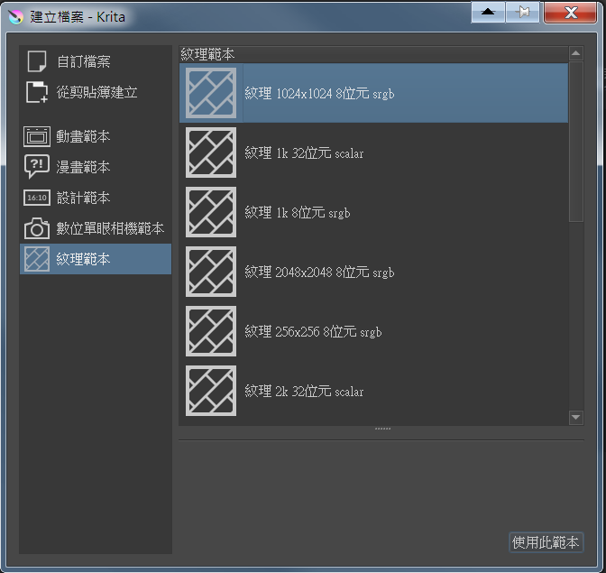

   Krita開新檔案

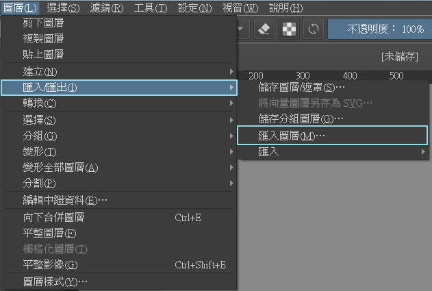

   Krita導入圖層

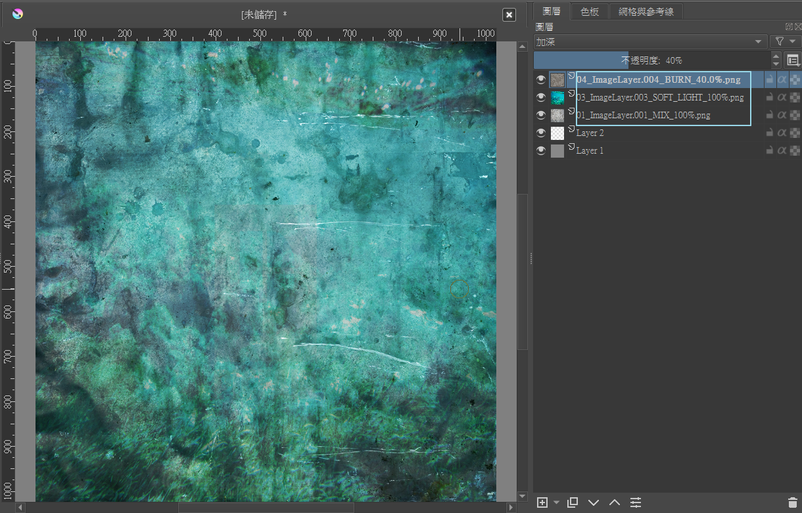

   完成合併圖層

合成PSD檔案--Photoshop
=======================
1. 啟用圖層資訊、設定圖層正確排序，輸出圖層。
2. 開啟Photoshop，檔案\指令碼\將檔案載入堆疊。
3. 選擇輸出的圖層影像，會按照順序排列好。
4. 按照導入的圖層影像資訊，設定圖層混合模式、不透明度。
5. 儲存成PSD檔案，便可再導入ACPainter中做為參考圖層，方便隨時修正。

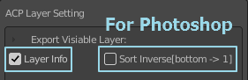

   輸出圖層給Photoshop設定

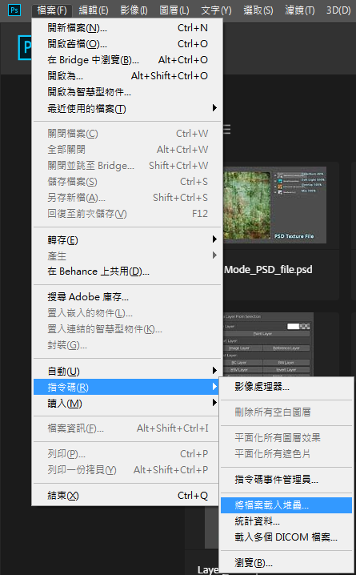

   Photoshop導入圖層

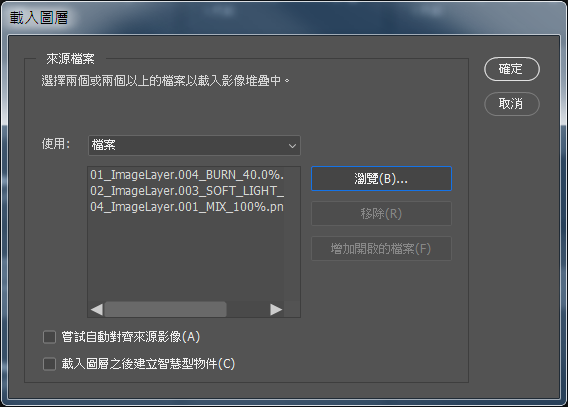

   Photoshop導入圖層列表

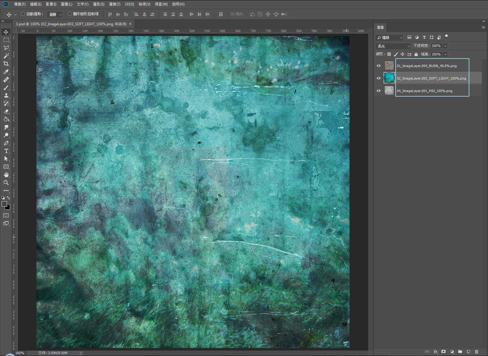

   完成合併圖層

合併所有可見圖層
=================
1. 設定好要合併的可視圖層，按下圖層合併鈕。
2. 稍等一會，合併的影像內容會儲存至一個新的繪畫圖層，以Composite開頭命名。
3. 合併影像內容以選擇物件的UV空間決定。

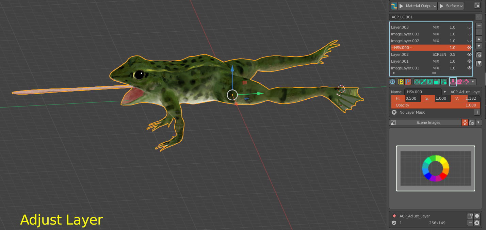

   在圖層列表中關閉不須合成的圖層

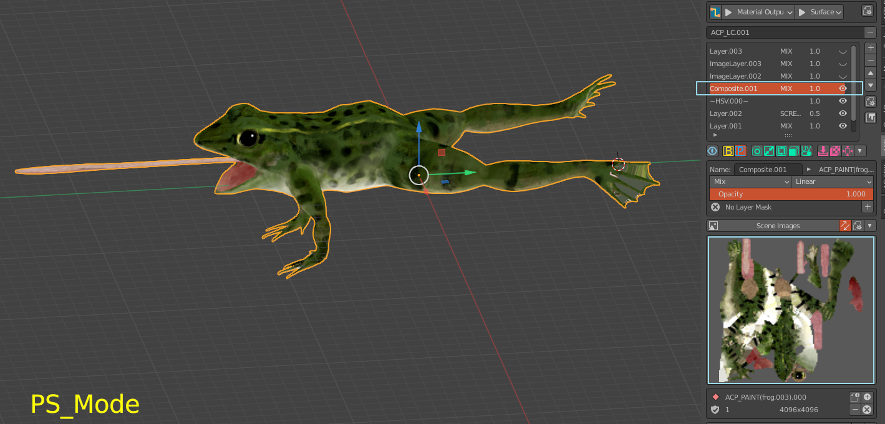

   可見圖層合併成新圖層

 

