*********
屏幕投影
*********
Blender於物件的紋理繪製模式中有一項屏幕投影的功能，不過使用上並不特別方便，
ACPainter基於自己的圖層系統改良了屏幕投影功能，除了原本的功能外更添加許多額外的好用功能，
甚至可以當作簡單的3D即時視窗烘焙功能。

改良的屏幕投影功能
======================
1. 捉取的屏幕範圍符合3D視窗畫面大小，捉取畫面中的主體物件不再比例大小令人困惑。
2. 投射影像至物體時，會偵測可投影圖層，大大降低投射影像失敗率。
3. 於物體模式即可使用，方便快速。

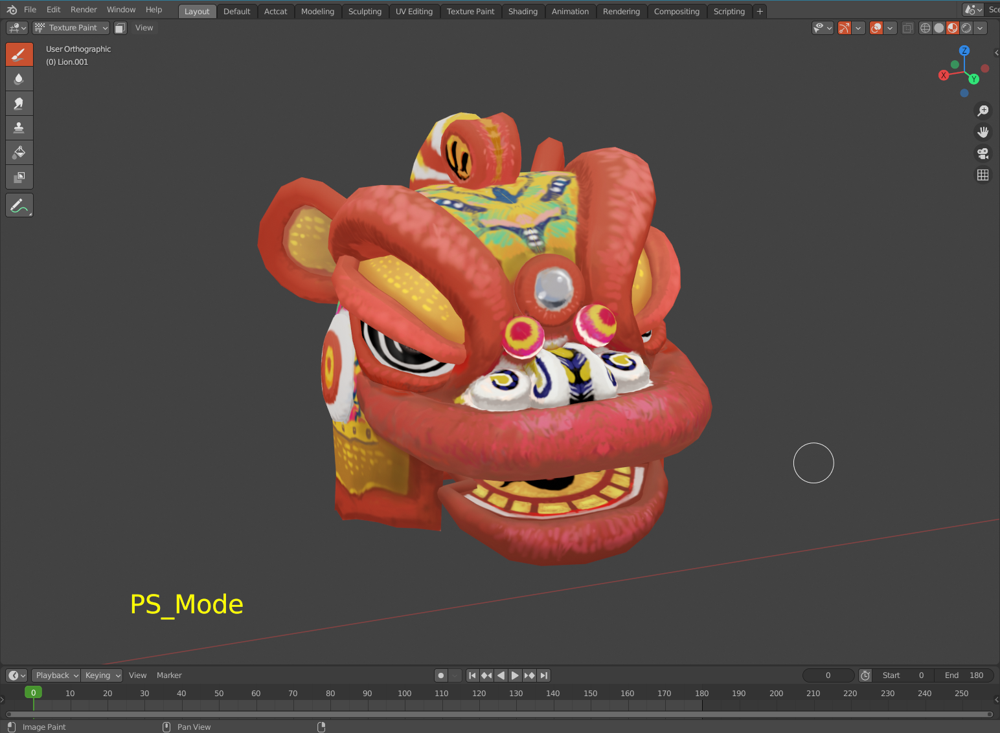

   3D視窗範圍

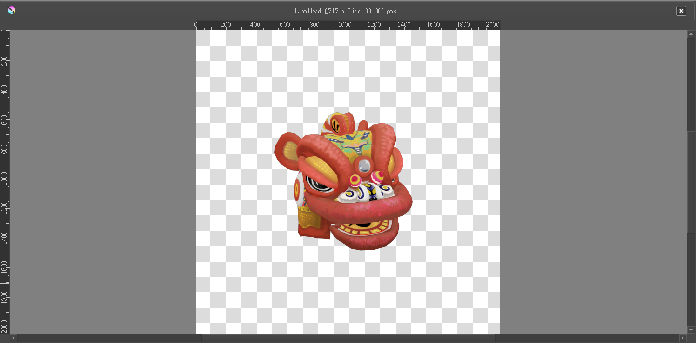

   Blender預設的屏幕捉圖範圍

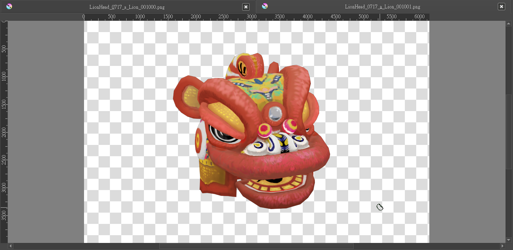

   ACP改良的屏幕捉圖範圍   

屏幕自投影功能
==============
屏幕自投影功能方便將3D視窗中的任何圖像投射至ACPainter圖層上，包括Eevee的畫面後製效果亦可捕捉。
以下是一個簡單範例：

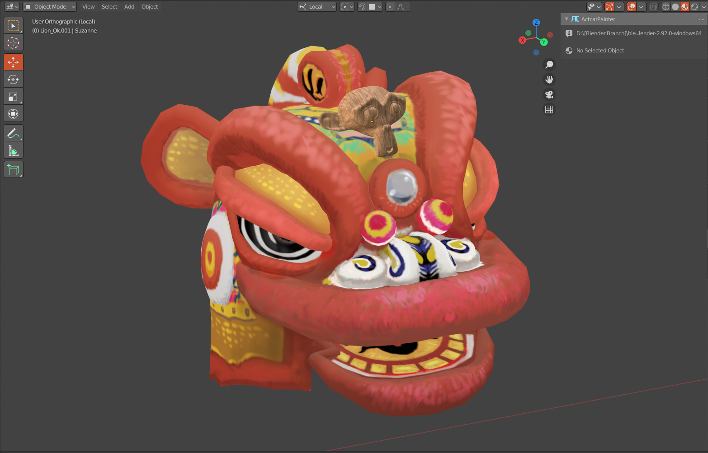

   設定猴頭模型材質、位置。

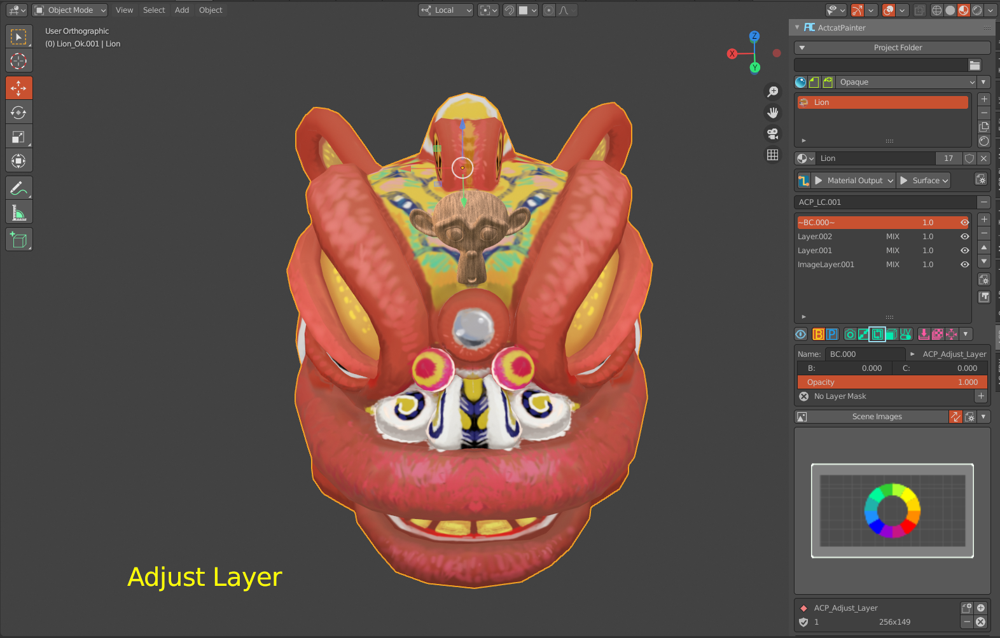

   3D視窗轉到合適的角度位置。

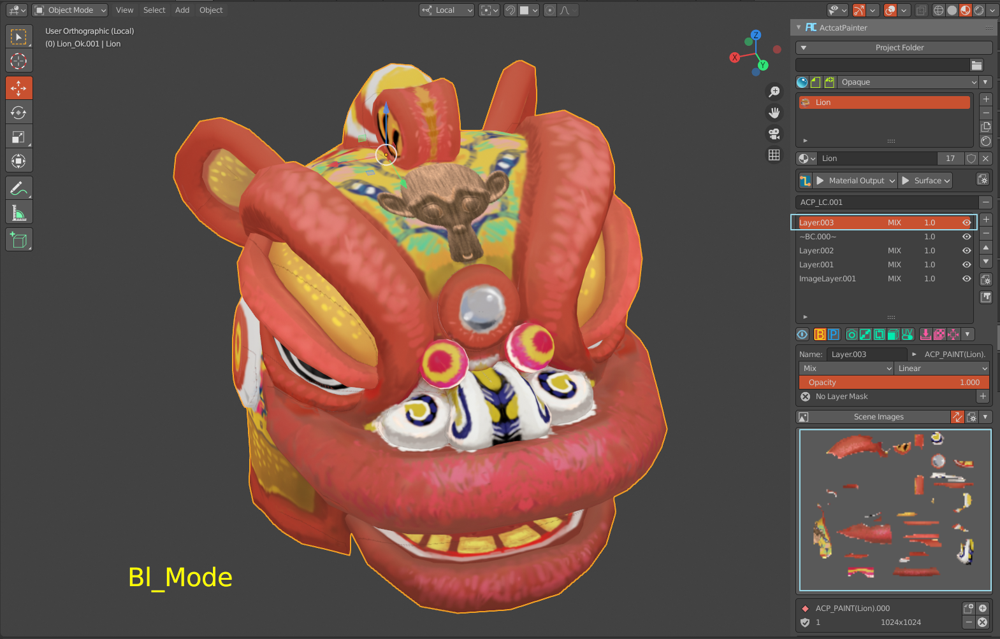

   猴頭的影像投射至圖層上。

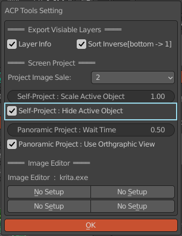

   關閉自投影物件顯示，可以只投影自身物件外的物體。

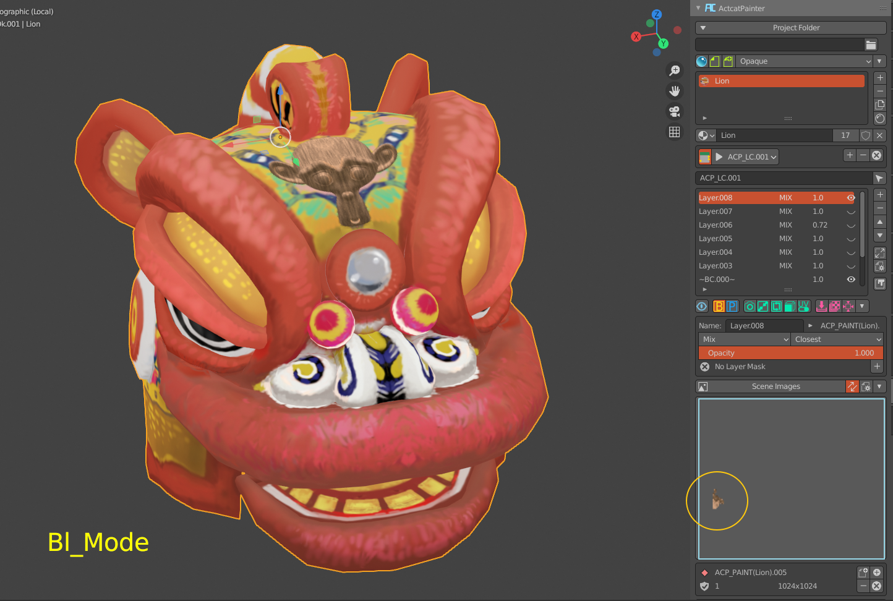

   圖層上只有自身物件外的物體投影資料。

屏幕全景投影
==============
屏幕全景投影利用六個正交視窗屏幕自投影快速取得視窗中的影像效果，並將之投射至物件上，可以快速創建物件貼圖，將材質效果轉換為貼圖。以下是效果範例：

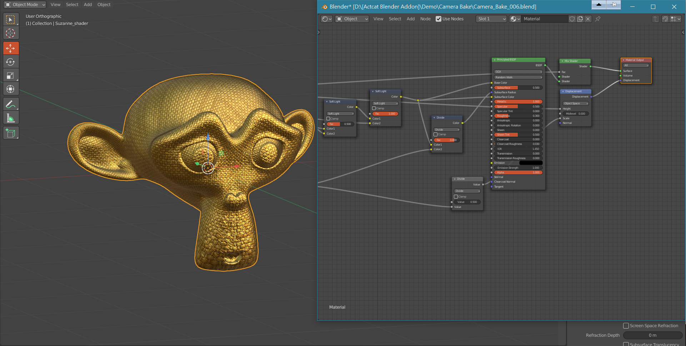

   設定好物件材質、細節模型。

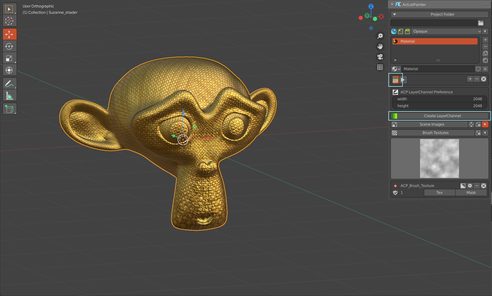

   在自由模式下，新增一個Bake用的圖層通道。

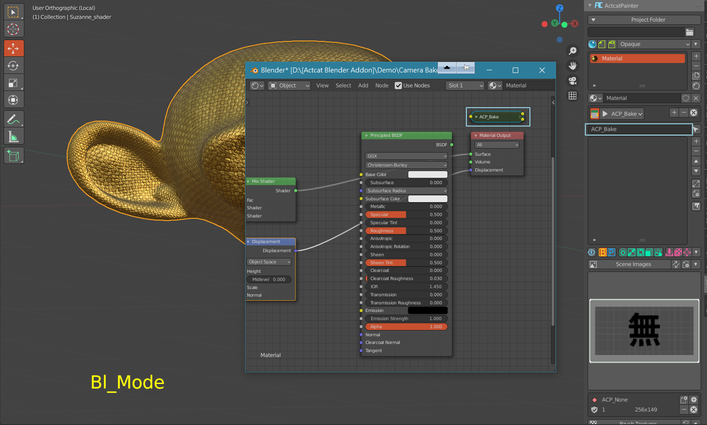

   將新增的圖層通道命名為ACP_Bake。

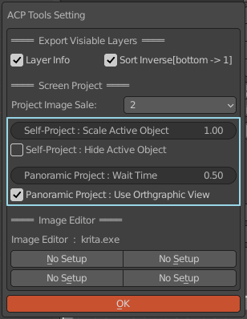

   設定屏幕全景投影參數。  

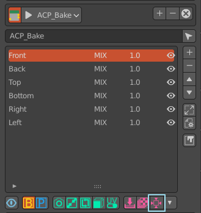

   按下按鈕，等待屏幕全景投影完成，完成後會有六個圖層，分別命名為Front、Back、Left、Right、Top、Bottom。

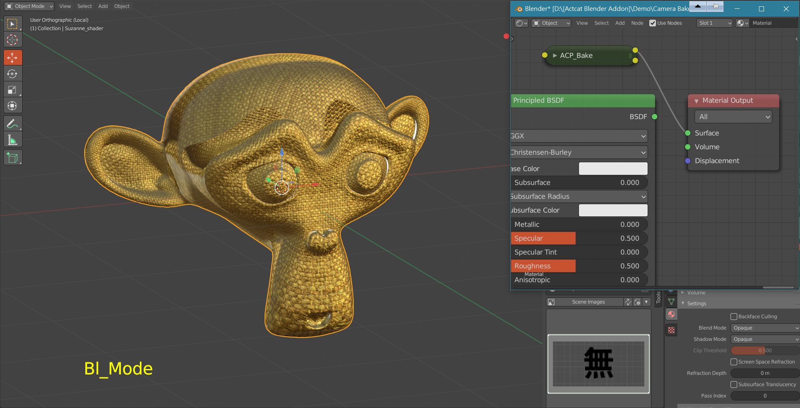

   將ACP_Bake節點連接至材質輸出於視窗中檢視效果，可依模型特性與用途，分別調整六圖層順序獲得最佳效果，圖層接縫可添加圖層遮罩去除之。 

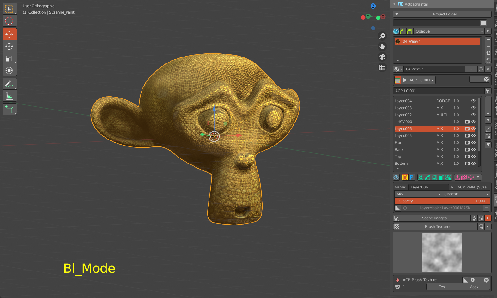

   簡易調整後完成圖(約15分鐘)。

更進階技巧，可看使用技巧章節。